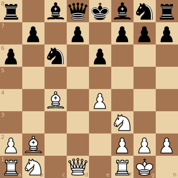

# chessdemo

[](https://github.com/ably-labs/chessdemo/actions/workflows/go.yml)

a simple demo using ably realitime API to transmit chess moves.

## Dependencies

- go 1.19

## Installation

`go install github.com/ably-labs/chessdemo@latest`

This will install the `chessdemo` in you `$(HOME)/go/bin` directory.


Alternatively, if you don't have Go installed, you can just grab 
pre-complied executables for your machine from 
[here](https://github.com/ably-labs/chessdemo/releases).

Otherwise 

## Playing

```
export ABLY_KEY=xxxxxxxxxxxxxxxxx
~/go/bin/chessdemo -name myname -game gameId
```

If you are the first player in the gameID game, then you play white.
If you are the second, you play black.
Otherwise you are a spectator.

You can force yourself to be a spectator by usig the `-watch` flag.

Input can be any move in [algebraic notation](https://en.wikipedia.org/wiki/Algebraic_notation_(chess)).
or:
- `resign`
- `show` which displays the positon in the default browser
  


## Using a chess engine
Figuring out good moves can be difficult. So why not use the number-crunching
power of your computer to do it for you.

To do this, use the `-engine` flag.


```
chessdemo -name myname -game gameId -engine stockfish
```

You can use [stockfish](https://stockfishchess.org/) (as above) or any UCI compliant chess engine.

To install stockfish on a mac, run

```
brew install stockfish
```

On Ubuntu run
```
sudo apt-get -y install stockfish
```

## Example Session

```
% ./chessdemo -name amnon
you are white
Waiting for an opponent to arrive.
Your opponent bill is playing black.
1: e4

 A B C D E F G H
8♜ ♞ ♝ ♛ ♚ ♝ ♞ ♜
7♟ ♟ ♟ ♟ ♟ ♟ ♟ ♟
6- - - - - - - -
5- - - - - - - -
4- - - - ♙ - - -
3- - - - - - - -
2♙ ♙ ♙ ♙ - ♙ ♙ ♙
1♖ ♘ ♗ ♕ ♔ ♗ ♘ ♖

f6

 A B C D E F G H
8♜ ♞ ♝ ♛ ♚ ♝ ♞ ♜
7♟ ♟ ♟ ♟ ♟ - ♟ ♟
6- - - - - ♟ - -
5- - - - - - - -
4- - - - ♙ - - -
3- - - - - - - -
2♙ ♙ ♙ ♙ - ♙ ♙ ♙
1♖ ♘ ♗ ♕ ♔ ♗ ♘ ♖

2: Nc3

 A B C D E F G H
8♜ ♞ ♝ ♛ ♚ ♝ ♞ ♜
7♟ ♟ ♟ ♟ ♟ - ♟ ♟
6- - - - - ♟ - -
5- - - - - - - -
4- - - - ♙ - - -
3- - ♘ - - - - -
2♙ ♙ ♙ ♙ - ♙ ♙ ♙
1♖ - ♗ ♕ ♔ ♗ ♘ ♖

g5

 A B C D E F G H
8♜ ♞ ♝ ♛ ♚ ♝ ♞ ♜
7♟ ♟ ♟ ♟ ♟ - - ♟
6- - - - - ♟ - -
5- - - - - - ♟ -
4- - - - ♙ - - -
3- - ♘ - - - - -
2♙ ♙ ♙ ♙ - ♙ ♙ ♙
1♖ - ♗ ♕ ♔ ♗ ♘ ♖

3: Qh5

 A B C D E F G H
8♜ ♞ ♝ ♛ ♚ ♝ ♞ ♜
7♟ ♟ ♟ ♟ ♟ - - ♟
6- - - - - ♟ - -
5- - - - - - ♟ ♕
4- - - - ♙ - - -
3- - ♘ - - - - -
2♙ ♙ ♙ ♙ - ♙ ♙ ♙
1♖ - ♗ - ♔ ♗ ♘ ♖


1. e4 f6 2. Nc3 g5 3. Qh5# 1-0
```


## Bugs
- All players require my Ably API Key
- No way to offer or accept a draw
- clunky user interface
- internally we should use UCI chess notation, rather than algebriac, which is harder to parse, more dependent on context,
and not understood by various chess libraries. Algebriac notation should only be used for user interaction.
